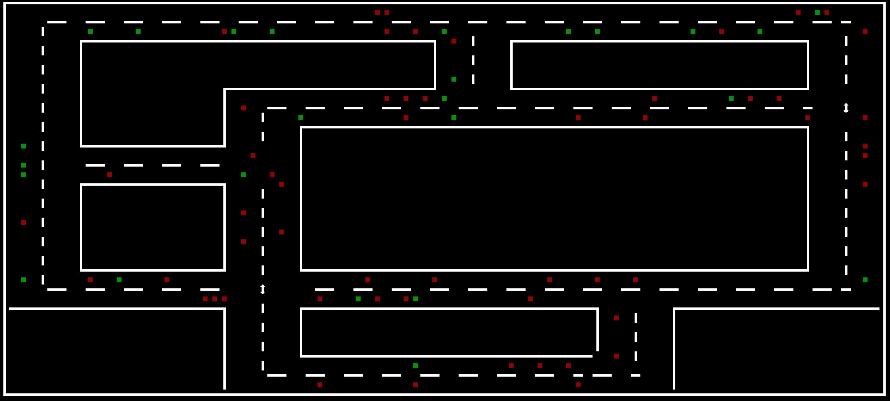

# Traffic-Simulation [ENG]
This is a traffic simulation that works with any map as long as it consists of the following parameters.

````
Directions: >, <, ^, v
Intersection: .
Traffic light: T
Boundaries: |, -
Corners:
    Top left: a
    Top right: b
    Bottom left: c
    Bottom right: d
````
````
Additional controls:

E: Stop
W: Speed +
S: Speed -
Q: Show lines (On/Off)
R: Reset
Escape: Exit
````


# Verkehrssimulation [GER]
Dies ist eine Verkehrssimulation die mit jeglicher Karte funktioniert, wenn sie aus folgenden Parametern besteht.

````
Fahrtrichtungen: >,<,^,v
Kreuzung: .
Ampel: T
Begrenzungen: | , -
Ecken:
    Linksoben: a
    Rechtsoben: b
    Linksunten: c
    Rechtsunten: d
````
````
Weitere Steuerung:

E: Stoppen
W: Speed +
S: Speed -
Q: Linien anzeigen (An/Aus)
R: Reset
Escape: Exit
````


