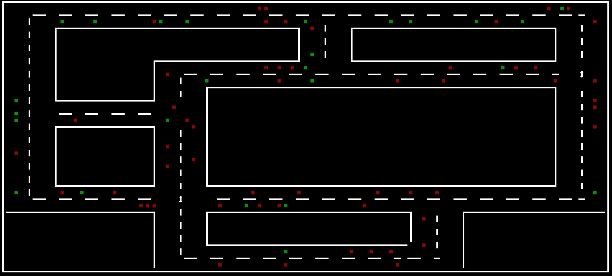

# Verkehrssimulation
Dies ist eine Verkehrssimulation die mit jeglicher Karte funktioniert, wenn sie aus folgenden Parametern besteht.

````
Fahrtrichtungen: >,<,^,v
Kreuzung: .
Ampel: T
Begrenzungen: | , -
Ecken:
    Linksoben: a
    Rechtsoben: b
    Linksunten: c
    Rechtsunten: d
````
````
Weitere Steuerung:

P: Stoppen
E: Speed +
W: Speed -
Q: Linien anzeigen (An/Aus)
R: Reset
Escape: Exit
````

